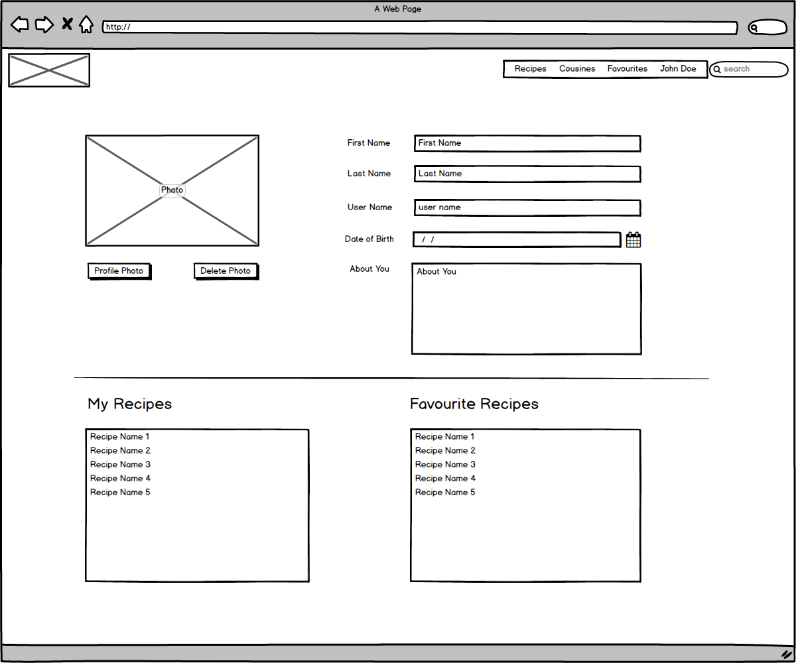

# Cookbook Project

About a year ago I have decided to adopt a helthier lifestyle and part of this change was based on health eating. I have seen several interesting recipes online but had no system to store them so I could refer back when needed.

The idea of building a recipes website for my 4th project for the Code Institute Full Stack Developer Course was just inline with a personal project.

The Recipes app can be viewed [here](http://gb-cookbook.herokuapp.com/)

## UX

### User Stories

1. As a visitor, I would like to be able to browse and search for recipes that fit some specific criterias.

2. As a registered user, I should be able to like recipes

3. A user should be able to search for most liked recipes.

4. A user should be able to create an account.

5. A registered user should be able to add recipes and edit the recipes he/she have added.

### Database Schema

The basic database diagram is as follow:


More information can be read in [Cookbook Documentation](docs/database/Cookbook-documentation.pdf)

### Wireframes

Some of the features of the original wireframes were modified in order to simplify the design and to dedicate enough time on the backend of the project.




## Features

* User registration: although ait is a simple user registration, the password is encrypted using generate_password_hash function from Werkzeug Security module.

* User login: Allows a user to login on the app. Once a user is logged in, it allows a user to like recipes, mark them as cooked, add new recipes and even edit/delete the ones created by the user.

* Search tab: Allow users to search a recipe by cuisine, likes/most recent/name and/or keyword.

* Search box in the navigation menu: Lists all recipes with the searched keyword.

* User page: List all recipes uploaded by the user, with the option to edit or delete the recipe.

* Recipe page: presents information and instructions about a specific recipe. If the recipe belongs to the user, the system alows the user to edit the recipe.

### Fase 2 features

* Ability to like a recipe from the main page, if the user is logged in.

* Ability to comment on recipes and like other users' comments.

* Pagination

* Add cuisines

* Export to PDF

## Technologies

* HTML 5

* CSS 3

* [Bootstrap](https://getbootstrap.com/)

* Javascript

* [Python 3](https://www.python.org/)

* [MongoDB](https://www.mongodb.com/)

## Tests

All pages have been tested extensively during development by myself. Once deployed, the app was tested by a small number of people, mainly family members and work coleagues that have reported any issues they have found.

* HTML validated by [The W3C Markup Validation Service](https://validator.w3.org/)

* CSS validated by [The W3C CSS Validation Service - Jigsaw](https://jigsaw.w3.org/css-validator/)

* Python compliant to PEP8 via [Pylint](https://pylint.org/). The only present issue is some lines of code are slightly longer than 79 characters.

## Compatibility

Tested on:

* Google Chrome

* Firefox

* Safari

## Deployment

The project is hosted on Heroku. In order for it to run correctly the following is required:

* A Procfile that instructs Heroku how to run the app.

* requirements.txt. This file informs Heroku what dependencies are required to run the app correctly. It is created by typing on the terminal `pip freeze > requirements.txt`.

* The last step is to setup the enviroment variables in Settings, Config Vars.

```python
MONGO_DBNAME
MONGO_URI
SECRET_KEY
PORT
IP
```

* Because Heroku is already connected to my Github account, I only had to connect the created heroku app to the Github repository and set up the automatic deployment.

## Local Deployment

* Clone the repository

* Create a virtual environment and install the dependencies.

* setup the environment variables

```python
app.config['MONGO_DBNAME'] = os.getenv("MONGO_DBNAME")
app.config['MONGO_URI'] = os.getenv("MONGO_URI")
app.config['SECRET_KEY'] = os.getenv("SECRET_KEY")
```

* On terminal type `python3 app.py`
